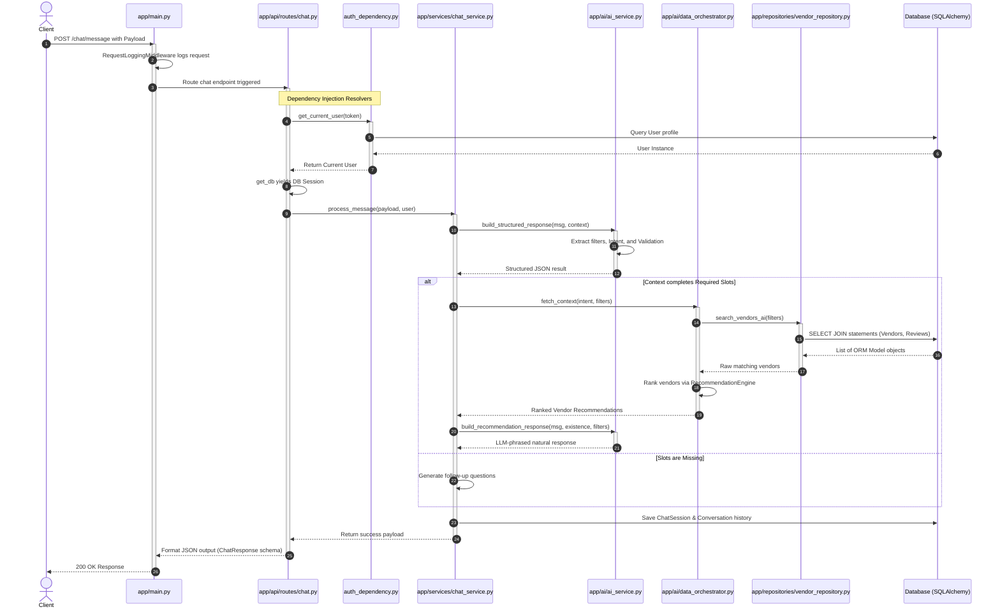
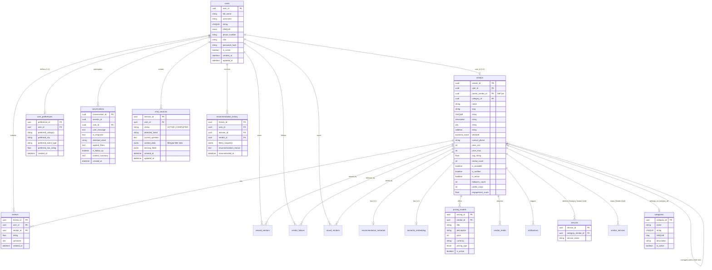
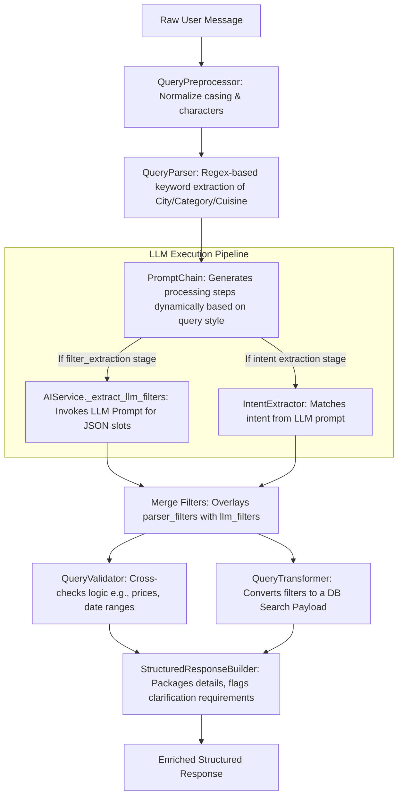
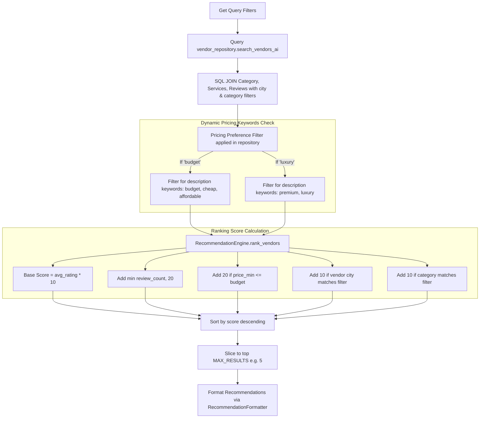
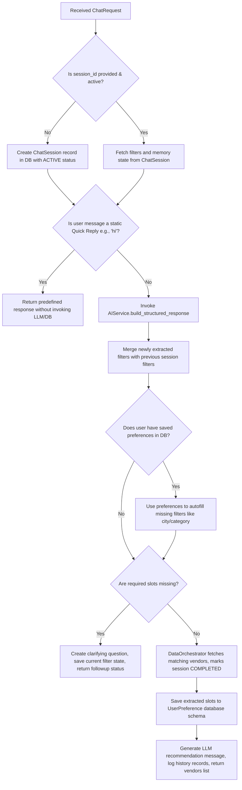

# System Architecture & Technical Documentation
## AI Vendor Discovery Agent Backend

**Version:** 1.0.0  
**Document Classification:** Technical Architecture Design  
**Target Audience:** Engineering Team & Stakeholders  

---

## 1. Executive Summary & System Overview

The **AI Vendor Discovery Agent** is an intelligent assistant designed to streamline vendor matching for event planners. Rather than relying on rigid keyword search bars, the platform employs a conversational, multi-turn AI Agent that decodes natural language user queries, validates details, logs state, and queries database entities using an automated parsing pipeline.

### Core Goals
1. **Conversational discovery**: Translate loose descriptions ("luxury decorator in Delhi under 50k") into precise, structured search filters.
2. **Multi-turn slot filling**: Automatically prompt users for missing details (such as budget constraints, cities, or guest counts) dynamically.
3. **Implicit personalization**: Track user preferences over time to bootstrap search parameters when undefined in the immediate chat context.
4. **Resilient execution**: Maintain low latencies with cache controls and graceful fallbacks when LLM endpoints experience rate limits or failures.

---

## 2. Layered Architecture Design

The backend conforms to a **Layered Architecture** pattern, enforcing a strict separation of concerns across five core layers:

```mermaid
graph TD
    %% Clients
    Client[Web Frontend / API Client]

    %% API Layer
    subgraph API_Layer ["1. API Layer (FastAPI)"]
        main_py["main.py (App Init & Config)"]
        auth_route["auth.py (Auth endpoints)"]
        chat_route["chat.py (Chat endpoints)"]
        query_route["query.py (AI Direct Diagnostic endpoints)"]
        vendor_route["vendor.py (Vendor CRUD)"]
        session_route["session.py (Session control)"]
        pydantic_schemas["Pydantic Schemas (app/schemas/)"]
    end

    %% Auth & Middleware
    subgraph Middleware_Layer ["Middleware & Guards"]
        logging_mid["RequestLoggingMiddleware"]
        cors_mid["CORSMiddleware"]
        exceptions["Custom Exception Handlers"]
        get_db["get_db (Session Generator)"]
        get_user["get_current_user (JWT Resolver)"]
    end

    %% Service Layer
    subgraph Service_Layer ["2. Service Layer (Business Logic)"]
        chat_svc["ChatService"]
        auth_svc["AuthService"]
        vendor_svc["VendorService"]
        session_svc["ChatSessionService"]
        pref_svc["UserPreferenceService"]
        conv_svc["ConversationService"]
        rec_hist_svc["RecommendationHistoryService"]
    end

    %% AI Layer
    subgraph AI_Layer ["3. AI Agent Layer (LLM Logic)"]
        ai_svc["AIService"]
        llm_fact["LLMFactory (Gemini, Groq, Ollama)"]
        prompt_loader["PromptLoader"]
        cache_handler["CacheHandler (In-Memory Cache)"]
        preprocessor["QueryPreprocessor"]
        parser["QueryParser (Regex extraction)"]
        intent_extractor["IntentExtractor"]
        prompt_chain["PromptChain"]
        validator["QueryValidator & FilterValidator"]
        transformer["QueryTransformer"]
        data_orch["DataOrchestrator"]
        rec_engine["RecommendationEngine"]
    end

    %% Repository Layer
    subgraph Repo_Layer ["4. Repository Layer (SQLAlchemy ORM)"]
        vendor_repo["vendor_repository.py"]
        category_repo["category_repository.py"]
    end

    %% DB Layer
    subgraph DB_Layer ["5. Database Layer"]
        db_session["session.py & database.py"]
        base_model["Base Model (base.py)"]
        db_models["SQLAlchemy Models (app/models/*)"]
        postgres["PostgreSQL / SQLite Database"]
    end

    %% Flow Arrows
    Client -->|HTTP / JSON| main_py
    main_py --> logging_mid
    main_py --> cors_mid
    main_py --> exceptions
    main_py --> auth_route & chat_route & query_route & vendor_route & session_route
    
    chat_route -->|Depends| get_db & get_user
    chat_route --> chat_svc
    
    chat_svc --> ai_svc
    chat_svc --> data_orch
    chat_svc --> session_svc & pref_svc & conv_svc & rec_hist_svc
    
    ai_svc --> llm_fact & cache_handler & prompt_loader
    ai_svc --> preprocessor & parser & intent_extractor & prompt_chain & validator & transformer
    
    data_orch --> rec_engine
    data_orch --> vendor_repo & category_repo
    session_svc & pref_svc & conv_svc & rec_hist_svc --> vendor_repo & category_repo
    
    vendor_repo & category_repo --> db_models
    db_models --> postgres
    db_session --> postgres
```

### Architectural Layer Responsibilities
* **API Layer**: Exposes endpoints via FastAPI routers. Serializes, validates incoming JSON using Pydantic models, and processes token-based authentication dependencies.
* **Service Layer**: Evaluates business invariants, governs session state transitions (e.g. active vs completed chat sessions), and logs execution metrics.
* **AI Agent Layer**: Normalizes human messages, extracts filters using rule-based/regex models paired with prompt execution chains, validates slot logic, and scores/ranks vendor profiles.
* **Repository Layer**: Encapsulates SQL data querying rules. Houses complex multi-table joins, queries, and filters using the SQLAlchemy ORM.
* **Database Layer**: Sets up ORM base models, maintains database engine pool configurations, and tracks raw data storage files or connections.

---

## 3. Request Flow & Middleware Architecture

When a request targets `/chat/message`, it transitions through several validation, logging, and processing nodes before executing code block logic:

---

## 4. Database Schema & Entity Relationships

The relational design models multiple tables linking users to vendors, tracking chat history, logging recommendation histories, and storing service definitions.

---

## 5. AI Agent & Natural Language Parsing Pipeline

Understanding natural language is split between deterministic keyword/regex extraction and generative LLM models to maximize precision and response reliability.

---

## 6. Vendor Scoring & Recommendation Mechanics

When filters match database entries, a multi-dimensional ranking algorithm is executed by the `RecommendationEngine` to score candidates and return the top matching options.

### Ranking Score Formula
$$\text{Score} = (\text{avg\_rating} \times 10) + \min(\text{review\_count}, 20) + P_{\text{budget}} + C_{\text{city}} + C_{\text{category}}$$

Where:
* $P_{\text{budget}} = 20$ if vendor's minimum price $\le$ user's budget, else $0$.
* $C_{\text{city}} = 10$ if the vendor's city matches the target query city, else $0$.
* $C_{\text{category}} = 10$ if the vendor's category matches the target query category, else $0$.

---

## 7. Conversational Dialog & Session State Machine

The conversation tracks session state across multiple turns. Missing slot configuration rules (such as mandatory cities or budgets) dictate whether the agent generates follow-up clarifying questions or final recommendations.

---

## 8. Technical Debt & Refactoring Roadmap

To transition the codebase into a production-ready framework, the following development roadmap should be followed:

### Phase 1: Database Setup & Configuration Consolidation
* **Action**: Eliminate the duplicate database session logic. Remove `app/db/database.py` and unify connection pooling within [app/db/session.py](file:///C:/Users/kashish/Desktop/Intern/ai_vendor/backend/app/db/session.py).
* **Action**: Remove the automatic schema creation hooks (`create_all()`) from [app/main.py](file:///C:/Users/kashish/Desktop/Intern/ai_vendor/backend/app/main.py#L138). Ensure all tables are initialized strictly via Alembic migrations.

### Phase 2: Decouple Service & Chat Pipelines
* **Action**: Refactor the monolithic `ChatService.process_message` method. Break it down into modular, single-responsibility step handlers (e.g., `QuickReplyResolver`, `PreferenceBootstrapper`, `RecommendationBuilder`).
* **Action**: Move hardcoded slots (e.g., the rules checking for guest count and budgets if catering) into an external configuration schema (`category_rules.json` or database tables) to conform to the Open-Closed Principle.

### Phase 3: AI Pipeline Improvements
* **Action**: Implement native async LLM clients. Reconfigure `LLMFactory` and `AIService` to run async completions instead of wrapping synchronous thread threads using `asyncio.to_thread`.
* **Action**: Swap the class-variable cache storage in [CacheHandler](file:///C:/Users/kashish/Desktop/Intern/ai_vendor/backend/app/ai/cache_handler.py) for a persistent Redis or Disk-backed SQLite store.
